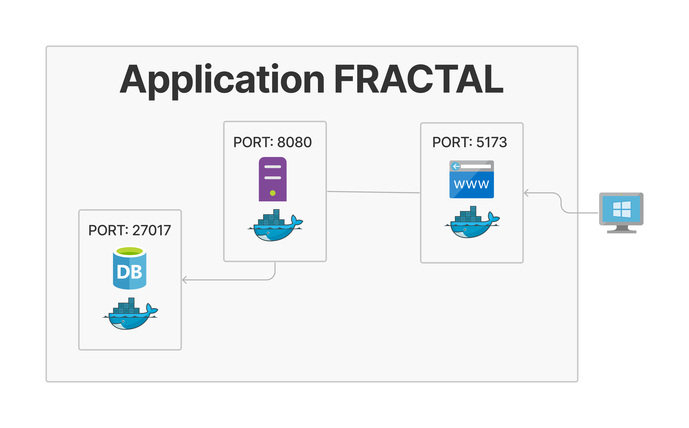

# Proyecto Fractal

Este proyecto es una aplicación web basada en Spring Boot y React.

## Estructura del proyecto



El proyecto se divide en dos carpetas principales:

- `server`: Contiene el código fuente del servidor backend desarrollado en Java utilizando Spring Boot.
- `client`: Contiene el código fuente del cliente frontend desarrollado en React.

## Requisitos previos

Asegúrate de tener instalado lo siguiente:

- Git
- Docker
- Docker Compose

## Configuración

Antes de ejecutar la aplicación, asegúrate de realizar la siguiente configuración:

1. En la carpeta `server`, modifica el archivo `.env` según sea necesario para configurar las variables de entorno del servidor backend.
2. En la carpeta `client`, modifica el archivo `.env` según sea necesario para configurar las variables de entorno del cliente frontend.

## Descarga

1. Clona el repositorio
```bash
git clone https://github.com/luismoroco/fractak-challengue
```
2. Ingresa al directorio
```bash
cd fractak-challengue
```

## Ejecución

Sigue los pasos a continuación para ejecutar la aplicación:

1. Abre una terminal en la raíz del proyecto.
2. Ejecuta el siguiente comando para iniciar los contenedores de Docker:

```bash
sudo make up
```
3. Ejecuta la App Node: 
```bash
bash ./setup.sh
```

4. Navega hasta el puerto web: 

Primero, agrega unos productos usando la UI en: 
[localhost:5173/products](http://localhost:5173/products)

Después puedes crear órdenes en:
[localhost:5173/orders](http://localhost:5173/orders)

5. Para terminar la ejecución, usa:
```bash
sudo make down
```

